# 🗄️ Entity-Relationship Diagram — Financial Advisor Platform

> MongoDB (NoSQL) schema modeled as an ER diagram. Relationships are expressed via ObjectId references and embedded sub-documents.

---

## 📊 Full ER Diagram (Mermaid)

```mermaid
erDiagram

    %% ─────────────────────────────────────────
    %%  CORE ENTITIES
    %% ─────────────────────────────────────────

    USER {
        ObjectId   _id                  PK
        String     name                 "required"
        String     email                "unique, required"
        String     username             "unique, sparse"
        String     password             "hashed (bcrypt)"
        String     googleId             "unique, sparse"
        String     picture              "profile photo URL"
        Boolean    isEmailVerified
        Number     age
        String     location
        String     language
        Number     monthlyIncome
        Number     familySize
        String     resetPasswordToken
        Date       resetPasswordExpires
        Date       lastLogin
        String[]   favoriteGames
        Object     gamePreferences
        Date       createdAt
        Date       updatedAt
    }

    TRANSACTION {
        ObjectId   _id                  PK
        ObjectId   userId               FK "ref: User"
        String     type                 "income | expense"
        Number     amount               "positive number"
        Date       date
        String     category             "enum: 17 categories"
        String     notes                "max 500 chars"
        String     source               "manual | receipt"
        String     receiptUrl
        String     text                 "description"
        Object     extractedData        "embedded"
        Number     ocrConfidence
        Boolean    needsReview
        Number     processingTime
        Date       createdAt
        Date       updatedAt
    }

    EXTRACTED_DATA {
        String     merchant
        String     location
        String     time
        Number     tax
        Number     total
        Number     itemCount
        String     paymentMethod
        String     receiptNumber
        String     cashier
    }

    GAME_PROGRESS {
        ObjectId   _id                  PK
        ObjectId   userId               FK "ref: User"
        String     gameType             "enum: 13 game types"
        Number     score                "0–100"
        Date       timestamp
        Number     totalPoints
        Number     level
        Number     experience
        Object[]   achievements         "embedded array"
        Object[]   rewards              "embedded array"
        Object     gameStats            "embedded"
        Object     multiplayerStats     "embedded"
        Object     learningProgress     "embedded"
        Mixed      details
        Date       createdAt
        Date       updatedAt
    }

    GAME_ACHIEVEMENT_EMBED {
        String     name
        String     description
        Date       earnedAt
        String     icon
    }

    GAME_REWARD_EMBED {
        String     type                 "badge|points|unlock"
        String     name
        String     description
        Number     value
        Date       earnedAt
    }

    ACHIEVEMENT {
        ObjectId   _id                  PK
        String     name                 "unique, required"
        String     description
        String     category             "game|learning|social|special"
        String     gameType             "enum: game types"
        Object     criteria             "embedded"
        Object     rewards              "embedded"
        String     icon
        String     rarity               "common|rare|epic|legendary"
        Boolean    isActive
        Date       createdAt
        Date       updatedAt
    }

    ACHIEVEMENT_CRITERIA {
        String     type                 "score|games_played|win_streak|..."
        Number     value
        String     condition            "greater_than|equal_to|less_than"
    }

    ACHIEVEMENT_REWARDS {
        Number     points
        Number     experience
        String     badge
        String     unlock
    }

    COMMUNITY {
        ObjectId   _id                  PK
        String     name                 "required"
        String     description
        String[]   members              "user IDs"
        String     owner                "user ID (creator)"
    }

    MESSAGE {
        ObjectId   _id                  PK
        ObjectId   community            FK "ref: Community"
        String     userId               "Clerk / Auth user ID"
        String     userName
        String     text
        Date       createdAt
    }

    MEETING {
        ObjectId   _id                  PK
        String     title                "required"
        String     description
        String     type                 "webinar|qna|other"
        String     date                 "ISO date"
        String     time                 "HH:MM"
        String     language
        String[]   topics
        String     expert
        String     joinUrl
        String     youtubeUrl
        String[]   attendees            "user IDs"
        Object[]   registrations        "embedded"
        String     duration
        Boolean    archived
        String     creator              "user ID"
        Date       createdAt
    }

    REGISTRATION_EMBED {
        String     name
        String     email
        String     phone
        String     organization
        String     experience           "beginner|intermediate|advanced|expert"
        String     questions
        String     userId
        Date       registrationDate
    }

    SUCCESS_STORY {
        ObjectId   _id                  PK
        String     title                "required"
        String     author               "required"
        String     region               "required"
        String     sector               "required"
        String     challenge            "required"
        String     summary              "required"
        String     fullStory            "required"
        String[]   keyLessons
        String     thumbnail
        Number     likes
        Number     views
        String     date
        Boolean    hasVideo
        String     videoUrl
        Date       createdAt
        Date       updatedAt
    }

    %% ─────────────────────────────────────────
    %%  RELATIONSHIPS
    %% ─────────────────────────────────────────

    USER                ||--o{ TRANSACTION       : "creates (1:N)"
    USER                ||--o{ GAME_PROGRESS     : "tracks (1:N)"
    TRANSACTION         ||--|| EXTRACTED_DATA    : "embeds (1:1)"
    GAME_PROGRESS       ||--o{ GAME_ACHIEVEMENT_EMBED : "earns (1:N)"
    GAME_PROGRESS       ||--o{ GAME_REWARD_EMBED : "collects (1:N)"
    COMMUNITY           ||--o{ MESSAGE           : "contains (1:N)"
    MEETING             ||--o{ REGISTRATION_EMBED : "has (1:N)"
    ACHIEVEMENT         ||--|| ACHIEVEMENT_CRITERIA : "defines (1:1)"
    ACHIEVEMENT         ||--|| ACHIEVEMENT_REWARDS  : "grants (1:1)"
```



---

## 📋 Entity Descriptions

### 👤 USER
Central entity of the platform. Stores authentication data (local + Google OAuth), user profile, and game preferences.

| Field | Type | Constraint | Notes |
|-------|------|------------|-------|
| `_id` | ObjectId | PK | Auto-generated |
| `email` | String | Unique, Required | Lowercase, trimmed |
| `username` | String | Unique, Sparse | Auto-generated from email if missing |
| `password` | String | Required (if no googleId) | bcrypt hashed |
| `googleId` | String | Unique, Sparse | Set on Google OAuth sign-in |
| `monthlyIncome` | Number | Min: 0 | Used for scheme recommendations |
| `gamePreferences` | Object | Embedded | difficulty (easy/medium/hard), notifications |

---

### 💸 TRANSACTION
Records every financial event (income or expense) for a user. Supports both manual entry and OCR receipt scanning.

| Field | Type | Constraint | Notes |
|-------|------|------------|-------|
| `userId` | ObjectId | FK → User, Required | User scoping |
| `type` | String | Enum: income/expense | Required |
| `amount` | Number | > 0, Required | Stored as float |
| `category` | String | Enum (17 values) | Income + expense categories |
| `source` | String | manual/receipt | Determines OCR fields |
| `receiptUrl` | String | Required if source=receipt | File path |
| `extractedData` | Object | Embedded | OCR-parsed receipt details |
| `ocrConfidence` | Number | 0–1 | AI extraction confidence score |
| `needsReview` | Boolean | — | Flags low-confidence entries |

**Indexed fields:** `userId`, `date`, `type`, `category`, `amount`, `createdAt`

**Income Categories:** Salary, Freelance, Business, Investment, Bonus, Other Income

**Expense Categories:** Food & Dining, Transportation, Housing, Utilities, Healthcare, Entertainment, Shopping, Education, Travel, Insurance, Other

---

### 🎮 GAME_PROGRESS
Tracks a user's progress per game type. One record per `(userId, gameType)` combination — enforced via compound unique index.

| Field | Type | Notes |
|-------|------|-------|
| `gameType` | String | One of 13 game types |
| `score` | Number | 0–100, last session score |
| `totalPoints` | Number | Cumulative points |
| `level` | Number | Current user level |
| `experience` | Number | XP for leveling system |
| `achievements[]` | Embedded | Achievements earned in this game |
| `rewards[]` | Embedded | Badges/unlocks collected |
| `gameStats.bestScore` | Number | All-time best |
| `gameStats.winStreak` | Number | Current win streak |
| `multiplayerStats.rank` | String | Bronze/Silver/Gold/etc. |
| `learningProgress.certificates[]` | Embedded | Course certificates |

**Game Types:** quiz, memory, budget, investment, wordpuzzle, break-the-bank-sorting, dolphin-dash-counting, money-bingo, budget-challenge, investment-simulator, financial-quiz, savings-goals, expense-tracker

---

### 🏆 ACHIEVEMENT
Global achievement definitions (seeded on startup). Not user-specific — users earn achievement snapshots embedded in `GameProgress.achievements[]`.

| Field | Type | Notes |
|-------|------|-------|
| `rarity` | String | common / rare / epic / legendary |
| `criteria.type` | String | score, games_played, win_streak, etc. |
| `criteria.value` | Number | Threshold value |
| `rewards.points` | Number | Points awarded on unlock |
| `rewards.badge` | String | Badge identifier |

---

### 🏘️ COMMUNITY
User-created discussion group. Members list stores user IDs (string). Real-time chat enabled via Socket.io.

| Field | Notes |
|-------|-------|
| `members[]` | Array of user ID strings |
| `owner` | Creator's user ID |

---

### 💬 MESSAGE
Chat messages linked to a Community. Sent and received in real-time via Socket.io rooms.

| Field | Notes |
|-------|-------|
| `community` | ObjectId → Community |
| `userId` | Auth user ID (string) |
| `text` | Message body |

---

### 📅 MEETING
Expert webinars, Q&A sessions, and online events. Contains embedded Registration sub-documents for attendee details.

| Field | Notes |
|-------|-------|
| `type` | webinar / qna / other |
| `attendees[]` | Simple list of user ID strings |
| `registrations[]` | Full embedded registration details |
| `youtubeUrl` | Recording link after session |
| `archived` | Soft-delete flag |

---

### 📖 SUCCESS_STORY
Financial journey stories submitted by users or admins. Used for community inspiration and learning.

| Field | Notes |
|-------|-------|
| `region` | Geographic scope of the story |
| `sector` | Business sector (farming, retail, etc.) |
| `keyLessons[]` | Array of lesson strings |
| `hasVideo` | Flag for video content |
| `likes`, `views` | Engagement counters |

---

## 🔗 Relationship Summary

| Relationship | Type | Description |
|---|---|---|
| User → Transaction | 1 : N | A user owns many transactions |
| User → GameProgress | 1 : N | A user has progress records per game type (max 1 per type) |
| Transaction → ExtractedData | 1 : 1 | Embedded OCR data inside transaction |
| GameProgress → AchievementEmbed | 1 : N | Embedded achievements earned per game session |
| GameProgress → RewardEmbed | 1 : N | Embedded rewards collected per game |
| Community → Message | 1 : N | A community contains many messages |
| Meeting → RegistrationEmbed | 1 : N | A meeting has many attendee registrations |
| Achievement → Criteria | 1 : 1 | Embedded unlock condition |
| Achievement → Rewards | 1 : 1 | Embedded prize definition |

---

## 📇 Database Indexes Reference

| Collection | Index | Type | Purpose |
|---|---|---|---|
| `transactions` | `userId` | Single | Filter by user |
| `transactions` | `date` | Single (-1) | Date-sorted queries |
| `transactions` | `type` | Single | Filter income/expense |
| `transactions` | `category` | Single | Category breakdown |
| `transactions` | `amount` | Single | Amount range queries |
| `transactions` | `createdAt` | Single (-1) | Recency sorting |
| `gameprogresses` | `{userId, gameType}` | Compound Unique | One record per user/game |
| `gameprogresses` | `score, timestamp` | Compound | Leaderboard queries |
| `gameprogresses` | `gameStats.totalGamesPlayed` | Single | Top players ranking |
| `gameprogresses` | `multiplayerStats.gamesWon` | Single | Multiplayer leaderboard |
| `users` | `email` | Single Unique | Login lookup |
| `users` | `username` | Single Unique Sparse | Profile lookup |
| `users` | `googleId` | Single Unique Sparse | OAuth lookup |

---

## 🗺️ Schema Dependency Map

```
                ┌─────────┐
                │  USER   │◄──────────────────────────────────┐
                └────┬────┘                                   │
                     │                                        │
         ┌───────────┼───────────┐                           │
         │           │           │                           │
         ▼           ▼           ▼                           │
  ┌─────────────┐ ┌──────────┐  ┌──────────────────────┐    │
  │ TRANSACTION │ │  GAME    │  │   (user ID refs in   │    │
  │             │ │ PROGRESS │  │  Community, Meeting, │    │
  │ ┌─────────┐ │ │          │  │   Message as String) │    │
  │ │EXTRACTED│ │ │┌────────┐│  └──────────────────────┘    │
  │ │  DATA   │ │ ││ACHIEVE.││                              │
  │ │(embed)  │ │ │└────────┘│                              │
  │ └─────────┘ │ │┌────────┐│                              │
  └─────────────┘ ││REWARDS ││                              │
                  │└────────┘│                              │
                  │┌────────┐│                              │
                  ││LEARNING││                              │
                  │└────────┘│                              │
                  └──────────┘                              │
                                                            │
  ┌─────────────┐  ┌──────────┐  ┌───────────────┐         │
  │  COMMUNITY  │  │ MEETING  │  │ SUCCESS_STORY │         │
  │             │  │          │  │               │         │
  │┌───────────┐│  │┌────────┐│  │               │         │
  ││  MESSAGE  ││  ││REGISTR.││  │               │         │
  ││  (ref)    ││  ││(embed) ││  │               │         │
  │└───────────┘│  │└────────┘│  │               │         │
  └─────────────┘  └──────────┘  └───────────────┘         │
                                                            │
  ┌─────────────────────────────────────────────────┐       │
  │               ACHIEVEMENT                       │       │
  │  (Global catalog — seeded at startup)           │       │
  │  ┌──────────────┐  ┌────────────────────────┐   │       │
  │  │   CRITERIA   │  │       REWARDS          │   │       │
  │  │  (embedded)  │  │     (embedded)         │   │       │
  │  └──────────────┘  └────────────────────────┘   │       │
  └─────────────────────────────────────────────────┘       │
                                                            │
  Legend:                                                   │
  ──────                                                    │
  → ObjectId reference (FK equivalent)                     │
  ┌──┐ Embedded sub-document                               │
  └──┘                                                     │
```

---

*Last Updated: July 2026 | Version: 2.0.0 | Database: MongoDB (Mongoose ODM)*
